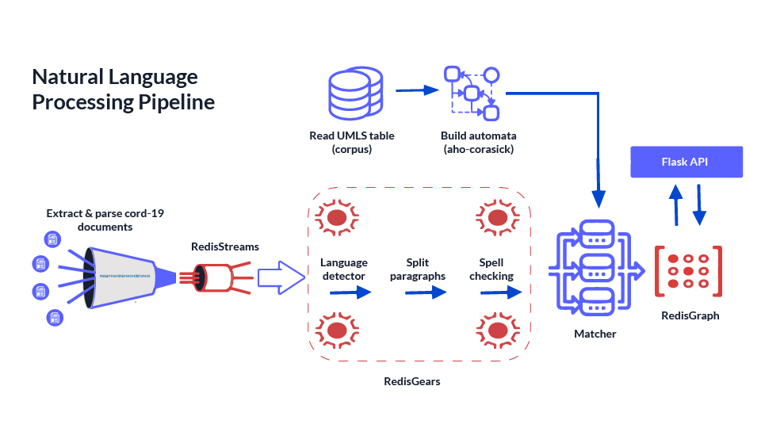
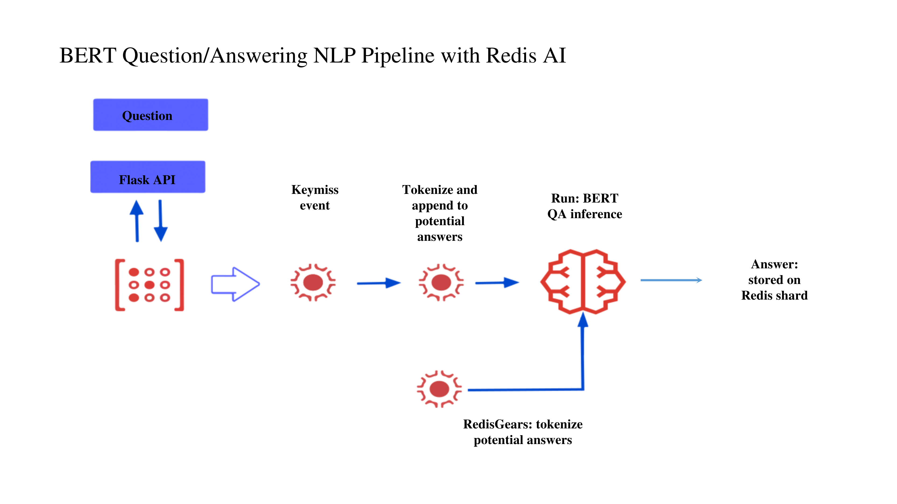
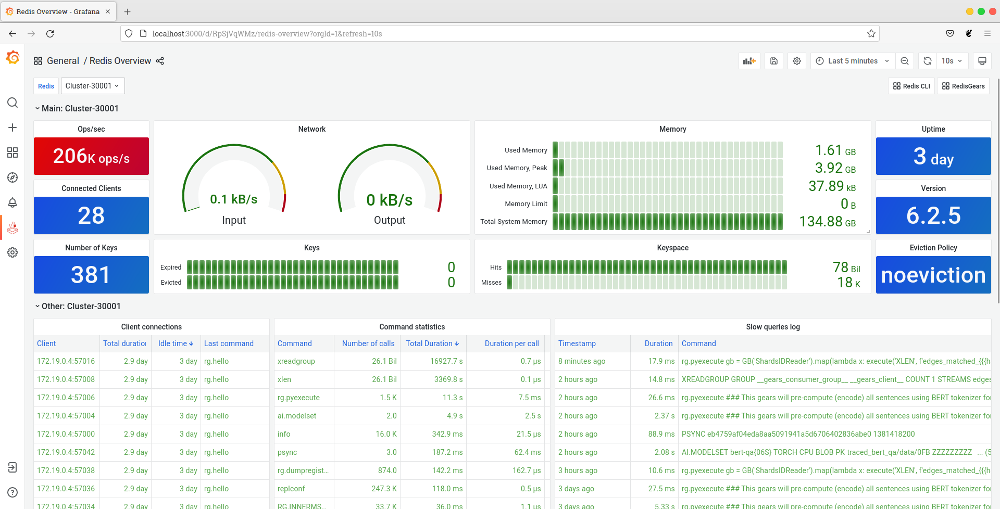

+++
title = "Benchmarks for BERT Large Question Answering inference for RedisAI and RedisGears"
description = "How to benchmark BERT Large Question Answering inference for RedisAI and RedisGears"
date = 2022-06-16

[taxonomies]
categories = ["inference", "performance", "monitoring"]
tags = ["redis","redis-cluster","redisai","redisgears","benchmark","performance","benchmarks"]

[extra]
toc = true
comments = false
+++
## Summary of the article
In this article, we will explore the challenges and opportunities of deployment a large BERT Question Answering Transformer model(bert-large-uncased-whole-word-masking-finetuned-squad) models inside Redis, from Huggingfac, where [RedisGears](https://developer.redis.com/howtos/redisgears?utm_campaign=write_for_redis) and [RedisAI](https://developer.redis.com/howtos/redisai/getting-started?utm_campaign=write_for_redis) perform a lot of heavy lifting while leveraging in-memory datastore Redis.

## Why do we need RedisAI?

* In data science load, you want to load high-performance hardware as close to 100% as possible 
* In user-facing load, you want to be able to distribute the load evenly, so it never reaches 100%, and client-facing servers can perform additional functions
* In data science, you prefer re-calculate results
* In a client-facing application, you prefer to cache results of calculation and fetch data from the cache as fast as possible to drive a seamless customer experience

Some numbers for inspiration and why to read this article:
```
python3 transformers_plain_bert_qa.py 
airborne transmission of respiratory infections is the lack of established methods for the detection of airborne respiratory microorganisms
10.351818372 seconds
```
The above script is a slightly modified transformers default pipeline for BERT QA, and running it on the server takes 10 seconds. The server is latest 12th Gen Intel(R) Core(TM) i9-12900K, [full cpuinfo](https://gist.github.com/AlexMikhalev/354ddc3094b0d3b95b11a411ea000a5a).

```
time curl -i -H "Content-Type: application/json" -X POST -d '{"search":"Who performs viral transmission among adults"}' http://localhost:8080/qasearch

real	0m0.747s
user	0m0.004s
sys	0m0.000s

```
Runs BERT QA inference on each shard, by default equal by the number of available CPUs, and returns answers under second.

# Background

BERT Question Answering inference works where the ML model selects an answer from the given text; in other words, BERT QA works like this: "What is the answer from the text, assuming the answer to the question exists within the paragraph selected." 
So it's important to select a text potentially containing an answer and a typical pattern to use Wikipedia data to build [Open Domain Question Answering](https://lilianweng.github.io/posts/2020-10-29-odqa/).

Our QA system is a domain-specific - medical domain-specific question/answering pipeline; hence we need a first pipeline that turns data into a knowledge graph. This NLP pipeline is available at Redis LaunchPad, full code is [open source](https://github.com/applied-knowledge-systems/the-pattern) and described in [previous article](https://developer.redis.com/howtos/nlp?utm_campaign=write_for_redis), 5 minute Redis Hackathon 2021 [video](https://www.youtube.com/watch?v=VgJ8DTX5Mt4) and architectural overview below:



# BERT Question Answering pipeline and API
In the BERT QA pipeline (or in any other modern NLP inference task), there are two steps:

1) Tokenize text - turn text into numbers
2) Run the inference - large matrix multiplication
With Redis, we have the opportunity to pre-compute everything and store it in memory, but how do we do it?
Unlike with summarization ML learning task, the question is not known in advance, so can't pre-compute all possible answers. But we can pre-tokenize all potential answers - all paragraphs in the dataset using RedisGears: 

```python
def parse_sentence(record):
    import redisAI
    import numpy as np
    global tokenizer
    if not tokenizer:
        tokenizer=loadTokeniser()
    hash_tag="{%s}" % hashtag()

    for idx, value in sorted(record['value'].items(), key=lambda item: int(item[0])):
        tokens = tokenizer.encode(value, add_special_tokens=False, max_length=511, truncation=True, return_tensors="np")
        tokens = np.append(tokens,tokenizer.sep_token_id).astype(np.int64) 
        tensor=redisAI.createTensorFromBlob('INT64', tokens.shape, tokens.tobytes())
        
        key_prefix='sentence:'
        sentence_key=remove_prefix(record['key'],key_prefix)
        token_key = f"tokenized:bert:qa:{sentence_key}:{idx}"
        redisAI.setTensorInKey(token_key, tensor)
        execute('SADD',f'processed_docs_stage3_tokenized{hash_tag}', token_key)

```
See [full code on github](https://github.com/applied-knowledge-systems/the-pattern-api/blob/156633b9934f1243775671ce6c18ff2bf471c0ce/qasearch/tokeniser_gears_redisai.py#L17)

Then for each Redis Cluster shard, we pre-load BERT QA model by downloading, exporting it into torchscript, then loading it to each shard:
```python
def load_bert():
    model_file = 'traced_bert_qa.pt'

    with open(model_file, 'rb') as f:
        model = f.read()
    startup_nodes = [{"host": "127.0.0.1", "port": "30001"}, {"host": "127.0.0.1", "port":"30002"}, {"host":"127.0.0.1", "port":"30003"}]
    cc = ClusterClient(startup_nodes = startup_nodes)
    hash_tags = cc.execute_command("RG.PYEXECUTE",  "gb = GB('ShardsIDReader').map(lambda x:hashtag()).run()")[0]
    print(hash_tags)
    for hash_tag in hash_tags:
        print("Loading model bert-qa{%s}" %hash_tag.decode('utf-8'))
        cc.modelset('bert-qa{%s}' %hash_tag.decode('utf-8'), 'TORCH', 'CPU', model)
        print(cc.infoget('bert-qa{%s}' %hash_tag.decode('utf-8')))
```
Full [code in github](https://github.com/applied-knowledge-systems/the-pattern-api/blob/156633b9934f1243775671ce6c18ff2bf471c0ce/qasearch/export_load_bert.py)

And when question comes from the user we tokenize and append question to potential answer before:

```python 
    token_key = f"tokenized:bert:qa:{sentence_key}"
    # encode question
    input_ids_question = tokenizer.encode(question, add_special_tokens=True, truncation=True, return_tensors="np")
    t=redisAI.getTensorFromKey(token_key)
    input_ids_context=to_np(t,np.int64)
    # merge (append) with potential answer, context - is pre-tokenized paragraph
    input_ids = np.append(input_ids_question,input_ids_context)
    attention_mask = np.array([[1]*len(input_ids)])
    input_idss=np.array([input_ids])
    num_seg_a=input_ids_question.shape[1]
    num_seg_b=input_ids_context.shape[0]
    token_type_ids = np.array([0]*num_seg_a + [1]*num_seg_b)
    # create actual model runnger for RedisAI
    modelRunner = redisAI.createModelRunner(f'bert-qa{hash_tag}')
    # make sure all types are correct
    input_idss_ts=redisAI.createTensorFromBlob('INT64', input_idss.shape, input_idss.tobytes())
    attention_mask_ts=redisAI.createTensorFromBlob('INT64', attention_mask.shape, attention_mask.tobytes())
    token_type_ids_ts=redisAI.createTensorFromBlob('INT64', token_type_ids.shape, token_type_ids.tobytes())
    redisAI.modelRunnerAddInput(modelRunner, 'input_ids', input_idss_ts)
    redisAI.modelRunnerAddInput(modelRunner, 'attention_mask', attention_mask_ts)
    redisAI.modelRunnerAddInput(modelRunner, 'token_type_ids', token_type_ids_ts)
    redisAI.modelRunnerAddOutput(modelRunner, 'answer_start_scores')
    redisAI.modelRunnerAddOutput(modelRunner, 'answer_end_scores')
    # run RedisAI model runner
    res = await redisAI.modelRunnerRunAsync(modelRunner)
    answer_start_scores=to_np(res[0],np.float32)
    answer_end_scores = to_np(res[1],np.float32)
    answer_start = np.argmax(answer_start_scores)
    answer_end = np.argmax(answer_end_scores) + 1
    answer = tokenizer.convert_tokens_to_string(tokenizer.convert_ids_to_tokens(input_ids[answer_start:answer_end],skip_special_tokens = True))
    log("Answer "+str(answer))
    return answer

```
Full [code in github](https://github.com/applied-knowledge-systems/the-pattern-api/blob/156633b9934f1243775671ce6c18ff2bf471c0ce/qasearch/qa_redisai_keymiss_no_cache_np.py#L34)

Overall call for BERT QA API looks like this:



Where I use two RedisGears cool features: capture event on key miss and async/await with the ability to run RedisAI on each shard and in non-locking for primary thread way - so Redis Cluster can continue to serve other customers. For benchmarks, caching RedisAI response is [disabled](https://github.com/applied-knowledge-systems/the-pattern-api/blob/156633b9934f1243775671ce6c18ff2bf471c0ce/qasearch/qa_redisai_keymiss_no_cache_np.py#L29) and if you are getting response time in nanoseconds on the second call rather then milliseconds you have deployed production version of RedisGears.


# Running Benchmarks

pre-requisite for running the benchmark:

Assuming you are running Debian or ubuntu, have docker and docker-compose (or can create a virtual environment via conda):

```
git clone --recurse-submodules https://github.com/applied-knowledge-systems/the-pattern.git
cd the-pattern
./bootstrap_benchmark_docker.sh
```

It should end with a curl call to qasearch API, Redis caching is disabled for the benchmark.

Curl call shall look like this:

```
time curl -i -H "Content-Type: application/json" -X POST -d '{"search":"Who performs viral transmission among adults"}' http://localhost:8080/qasearch
```
with output:
```
HTTP/1.1 200 OK
Server: nginx/1.18.0 (Ubuntu)
Date: Sun, 29 May 2022 12:05:39 GMT
Content-Type: application/json
Content-Length: 2120
Connection: keep-alive

{"links":[{"created_at":"2002","rank":13,"source":"C0001486","target":"C0152083"}],"results":[{"answer":"adenovirus","sentence":"The medium of 40 T150 flasks of adenovirus transducer dec CAR CHO cells yielded 0 5 1 my of purified msCEACAM1a 1 4 protein","sentencekey":"sentence:PMC125375.xml:{mG}:202","title":"Crystal structure of murine sCEACAM1a[1,4]: a coronavirus receptor in the CEA family"}] OUTPUT_REDUCTED}
```
I modified the output of API for the benchmark to return results from all shards - even if the answer is empty, in the run above five shards return answers, overall API call response under second with all additional hops to search in RedisGraph.  


# Deep Dive into Benchmark

Let's dig deeper into what's happening under the hood:

There is a sentence key with shard id or grab "Cache key" from `docker logs -f rgcluster`, in my setup cache key "bertqa{6fd}_PMC169038.xml:{6fd}:33_Who performs viral transmission among adults". If you think it looks like a function call - it's a function call, which is triggered if key isn't present in Redis Cluster, which is for benchmark will be every time, since we disabled saving output for cache in a previous paragraph.

One more thing is to figure out from logs the port of the shard corresponding to hashtag (also known as shard id, stuff in curly brackets – like this {6fd}, same will be in the output for export_load script, in my case Cache key was in "30012.log" so my port 30012

Check that the call works:

```
redis-cli -c -p 300012 -h 127.0.0.1 get "bertqa{6fd}_PMC169038.xml:{6fd}:33_Who performs viral transmission among adults"
```

and then run the benchmark:
```
redis-benchmark -p 30012 -h 127.0.0.1 -n 10 get "bertqa{6fd}_PMC169038.xml:{6fd}:33_Who performs viral transmission among adults"
====== get bertqa{6fd}_PMC169038.xml:{6fd}:33_Who performs viral transmission among adults ======
  10 requests completed in 0.04 seconds
  50 parallel clients
  3 bytes payload
  keep alive: 1

10.00% <= 41 milliseconds
100.00% <= 41 milliseconds
238.10 requests per second
```

-n = number of times.

add

– csv if you want to output in CSV format

– precision 3 – if you want more decimals in ms

More information about benchmarking tool https://redis.io/topics/benchmarks?utm_campaign=write_for_redis

if you don't have redis-utils installed locally, you can run the same via

```bash
docker exec -it rgcluster /bin/bash
redis-benchmark -p 30012 -h 127.0.0.1 -n 10 get "bertqa{6fd}_PMC169038.xml:{6fd}:33_Who performs viral transmission among adults"
====== get bertqa{6fd}_PMC169038.xml:{6fd}:33_Who performs viral transmission among adults ======                                                
  10 requests completed in 1.75 seconds
  50 parallel clients
  99 bytes payload
  keep alive: 1
  host configuration "save": 
  host configuration "appendonly": no
  multi-thread: no

Latency by percentile distribution:
0.000% <= 243.711 milliseconds (cumulative count 1)
50.000% <= 987.135 milliseconds (cumulative count 5)
75.000% <= 1577.983 milliseconds (cumulative count 8)
87.500% <= 1662.975 milliseconds (cumulative count 9)
93.750% <= 1744.895 milliseconds (cumulative count 10)
100.000% <= 1744.895 milliseconds (cumulative count 10)

Cumulative distribution of latencies:
0.000% <= 0.103 milliseconds (cumulative count 0)
10.000% <= 244.223 milliseconds (cumulative count 1)
20.000% <= 409.343 milliseconds (cumulative count 2)
30.000% <= 575.487 milliseconds (cumulative count 3)
40.000% <= 821.247 milliseconds (cumulative count 4)
50.000% <= 987.135 milliseconds (cumulative count 5)
60.000% <= 1157.119 milliseconds (cumulative count 6)
70.000% <= 1497.087 milliseconds (cumulative count 7)
80.000% <= 1577.983 milliseconds (cumulative count 8)
90.000% <= 1662.975 milliseconds (cumulative count 9)
100.000% <= 1744.895 milliseconds (cumulative count 10)

Summary:
  throughput summary: 5.73 requests per second
  latency summary (msec):
          avg       min       p50       p95       p99       max
     1067.296   243.584   987.135  1744.895  1744.895  1744.895
```

The platform only has 20 articles, 8 Redis nodes = 4 masters + 4 slaves, so relevance would be wrong and doesn't need a lot of memory.

## AI.INFO
Now let's check how long our RedisAI model runs on this ({6fd}) shard: 
```
127.0.0.1:30012> AI.INFO bert-qa{6fd}
 1) "key"
 2) "bert-qa{6fd}"
 3) "type"
 4) "MODEL"
 5) "backend"
 6) "TORCH"
 7) "device"
 8) "CPU"
 9) "tag"
10) ""
11) "duration"
12) (integer) 8928136
13) "samples"
14) (integer) 58
15) "calls"
16) (integer) 58
17) "errors"
18) (integer) 0

```
Where `bert-qa{6fd}` is the key of the actual model saved (and its large model). AI.INFO gives us a cumulative duration 8928136 in microseconds and a number of calls 58, which is approximately 153 milliseconds per call. 
Let's make sure about it, reset stats and re-run the benchmark:
```
127.0.0.1:30012> AI.INFO bert-qa{6fd} RESETSTAT
OK
127.0.0.1:30012> AI.INFO bert-qa{6fd}
 1) "key"
 2) "bert-qa{6fd}"
 3) "type"
 4) "MODEL"
 5) "backend"
 6) "TORCH"
 7) "device"
 8) "CPU"
 9) "tag"
10) ""
11) "duration"
12) (integer) 0
13) "samples"
14) (integer) 0
15) "calls"
16) (integer) 0
17) "errors"
18) (integer) 0
``` 
And re-run the benchmark again:
```
redis-benchmark -p 30012 -h 127.0.0.1 -n 10 get "bertqa{6fd}_PMC169038.xml:{6fd}:33_Who performs viral transmission among adults"
====== get bertqa{6fd}_PMC169038.xml:{6fd}:33_Who performs viral transmission among adults ======                                                 
  10 requests completed in 1.78 seconds
  50 parallel clients
  99 bytes payload
  keep alive: 1
  host configuration "save": 
  host configuration "appendonly": no
  multi-thread: no

Latency by percentile distribution:
0.000% <= 188.927 milliseconds (cumulative count 1)
50.000% <= 995.839 milliseconds (cumulative count 5)
75.000% <= 1606.655 milliseconds (cumulative count 8)
87.500% <= 1692.671 milliseconds (cumulative count 9)
93.750% <= 1779.711 milliseconds (cumulative count 10)
100.000% <= 1779.711 milliseconds (cumulative count 10)

Cumulative distribution of latencies:
0.000% <= 0.103 milliseconds (cumulative count 0)
10.000% <= 189.183 milliseconds (cumulative count 1)
20.000% <= 392.191 milliseconds (cumulative count 2)
30.000% <= 540.159 milliseconds (cumulative count 3)
40.000% <= 896.511 milliseconds (cumulative count 4)
50.000% <= 996.351 milliseconds (cumulative count 5)
60.000% <= 1260.543 milliseconds (cumulative count 6)
70.000% <= 1456.127 milliseconds (cumulative count 7)
80.000% <= 1606.655 milliseconds (cumulative count 8)
90.000% <= 1692.671 milliseconds (cumulative count 9)
100.000% <= 1779.711 milliseconds (cumulative count 10)

Summary:
  throughput summary: 5.62 requests per second
  latency summary (msec):
          avg       min       p50       p95       p99       max
     1080.454   188.800   995.839  1779.711  1779.711  1779.711
```
Now checking stats again:
```
AI.INFO bert-qa{6fd}
 1) "key"
 2) "bert-qa{6fd}"
 3) "type"
 4) "MODEL"
 5) "backend"
 6) "TORCH"
 7) "device"
 8) "CPU"
 9) "tag"
10) ""
11) "duration"
12) (integer) 1767749
13) "samples"
14) (integer) 20
15) "calls"
16) (integer) 20
17) "errors"
18) (integer) 0
```
We are at 88387.45 microseconds per call, which is pretty fast; also, considering we have started with 10 seconds per call, I think the benefits of using RedisAI in combination with RedisGears are pretty obvious; the trade-off is memory usage.

There are many ways to optimize this deployment; for example, add FP16 quantization and ONNX runtime, and if you want to contribute it [script](https://github.com/applied-knowledge-systems/the-pattern-api/blob/7bcf021e537dc8d453036730f0a993dd52e1781f/qasearch/export_load_bert.py) will be a good starting point.

# Using Graphana to monitor RedisGears throughput, CPU, and Memory usage

And thanks to the contribution of [Mikhail Volkov](https://volkovlabs.com/from-a-basic-redistimeseries-data-source-to-2-million-downloads-in-grafana-marketplace-9921ed9ac5a), we can now observe RedisGears and RedisGraph throughtput and memory consumption using Graphana, when you cloned repository it started graphana docker, which have pre-build templates to monitor RedisCluster - which include RedisGears and RedisAI, and Graph - which is Redis with RedisGraph, "The Pattern" dashboard provides an overall overview. 




# Learn More About Redis
For more information about Redis see the following:

- Visit the [Redis Developer Hub](https://redis.info/3LC4GqB) - tools, guides, and tutorials about Redis
- Download the [RedisInsight Desktop GUI](https://redis.info/3wMR7PR) to view and manage your data in Redis
- Watch this video on the [benefits of Redis Cloud versus other Redis providers](https://redis.info/3Ga9YII)
- [Try Redis Cloud for free](https://redis.info/3NBGJRT)