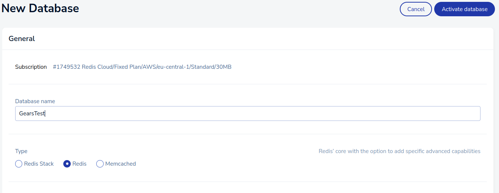

+++
title="Turning Open Source project into Product with Redis Enterprise"
date=2022-08-19

[taxonomies]
categories = ["Redis"]
tags = ["Redis Enterprise", "roadmap","product","oauth2","github", "sponsors"]
[extra]
toc = true
comments = true
+++

# Turning Open Source project into Product with Redis Enterprise
# Overview 
# Background
## History 
Last year, my reference project, "The Pattern", was the hackathon winner 2021 and got a bit of publicity and, in total, seven forks. But as with many open source projects, it is now stale. Time to revive "The Pattern" with new features and GitHub sponsors or Patreon patrons to help and inspire developers and creatives. In return, it's common to provide sponsor-only features and articles. Nevertheless, how can we do it with a large Redis-based machine learning pipeline?  
## Plan sponsor only features
This article will introduce a simple first step:
for GitHub sponsors, we start with offering persistent storage of preferences: I have a simple flask POST API which adds nodes into the user's preference storage - a simple Redis set per user. And it will be a foundation to build other sponsor-only features.
For now, let's cover the basics:

# Overall architecture overview


flowchart LR
    id1(User) --> flask_login(Flask Login API)--> github(GitHub OAuth2)
    github-->flask_callback(Flask API callback)-->GitHubGraphQL(GitHub GraphQL)


## Add Github oauth2 to Rest API

There are a number of API's that GitHub offers to help developers, but the GitHub Authentication API is one of the most popular. This API allows you to log in to GitHub using your username and password, or OAuth token.

A login button with a standard OIDC/OAuth2 dance is one of the most common ways for a user to authenticate to an API.
Below code taken from this [gist]((https://gist.github.com/xros/aba970d1098d916200d0acce8feb0251)) and is very common for OAuth2 flows:

```python
import os 
client_id = os.getenv('GITHUB_CLIENT_ID')
client_secret = os.getenv('GITHUB_SECRET')
@app.route('/', methods=['GET', 'POST'])
def index():
    url = 'https://github.com/login/oauth/authorize'
    params = {
        'client_id': client_id,

        'scope': 'read:user,read:email',
        'state': str(uuid4().hex),
        'allow_signup': 'true'
    }
    url = furl(url).set(params)
    return redirect(str(url), 302)
```
where GITHUB_CLIENT_ID and GITHUB_SECRET are client/secret GitHub Oauth2 apps. Register for following process on [GitHub](https://github.com/settings/applications/new)

* On callback:
    * Fetch username, email, and other profile information- in case we need to contact them   
    * get the status of the user - if they are sponsor of the organisation
        * if they are sponsor 
        * add the username to the set of sponsors in Redis
            
```python 
org_name="applied-knowledge-systems"
@app.route('/oauth2/callback')
def oauth2_callback():

    code = request.args.get('code')
    access_token_url = 'https://github.com/login/oauth/access_token'
    payload = {
        'client_id': client_id,
        'client_secret': client_secret,
        'code': code,
        # 'redirect_uri':
        'state': str(uuid4().hex)
    }
    r = requests.post(access_token_url, json=payload, headers={'Accept': 'application/json'})
    access_token = json.loads(r.text).get('access_token')
    print(access_token)
    
    access_user_url = 'https://api.github.com/user'
    response = requests.get(access_user_url, headers={'Authorization': 'token ' + access_token})
    data=response.json()
    user_email=data["email"]
    user_login=data["login"]
    user_id=data["id"]
    # response=redirect(url_for('login',next=redirect_url()))
    # response.set_cookie('user_id', str(user_id))
    # response.set_cookie('user_login', str(user_login))
    # return response
    query = """
        {
        viewer {
            sponsorshipsAsSponsor(first: 100) {
            nodes {
                sponsorable {
                ... on User {
                    id
                    email
                    url
                }
                ... on Organization {
                    id
                    email
                    name
                    url
                }
                }
                tier {
                id
                name
                monthlyPriceInDollars
                monthlyPriceInCents
                }
            }
            }
        }
        }
        """
    response_graphql = requests.post('https://api.github.com/graphql', json={'query': query}, headers={'Authorization': 'token ' + access_token})
    response_graphql_data=response_graphql.json()["data"]
    if isinstance (response_graphql_data["viewer"]["sponsorshipsAsSponsor"]["nodes"], list):
      if response_graphql_data["viewer"]["sponsorshipsAsSponsor"]["nodes"][0]["sponsorable"]["name"]==org_name:
          # if user is a sponsor of Applied Knowledge System add them to set of sponsors
         redis_client.sadd(f'sponsors:{org_name}',user_id)
    # if RedisJSON enabled:
    # redis_client.json().set(f"user_details:{user_id}", '$', {
    #     'email': user_email,
    #     'id': user_id,
    #     'user_login': user_login,
    #     'graphql': response_graphql_data,
    # }) 
    #if not
    redis_client.hset(f"user_details:{user_id}", mapping={
        'email': user_email,
        'id': user_id,
        'user_login': user_login
    })
    return jsonify({
        'status': 'success',
        'email': user_email,
        'id': user_id,
        'user_login': user_login
    })
```
The API we are using for our sponsor-only feature is straightforward:

```python
@app.route('/exclude', methods=['POST','GET'])
def mark_node():
    if request.method == 'POST':
        if 'id' in request.json:
            node_id=request.json['id']
    else:
        if 'id' in request.args:
            node_id=request.args.get('id')
    user_id = session.get('user_id')
    log(f"Got user {user_id} from session")
    if not user_id:
        user_id = request.cookies.get('user_id')
        log(f"Got user {user_id} from cookie")
    redis_client.sadd("user:%s:mnodes" % user_id,node_id)
    response = jsonify(message=f"Finished {node_id} and {user_id}")
    return response
```

And the only purpose of this API is to mark nodes as unimportant for the given user by adding nodes to RedisSet, and those nodes will be excluded from search API output. So far, everything was pretty standard: basic flask API and GitHub Social login flow. Now let's add Redis Enterprise and synchronise sponsors preferences.

# Add Redis Enterprise
Why not use Redis Enterprise directly for everything? 
The project is memory-heavy, with a lot of data and machine learning inside Redis. This allows to achieve state-of-the-art performance, but it also takes over 120 GB RAM (or as much RAM as you can give it), and 128 GB Redis Enterprise instance will exceed my budget for open-source project. Obviously if there will be enough sponsors we can move more functionality into Redis Enterprise, but for that we need to finish building basic blocks. Register on [Redis.com](https://redis.com/) cloud and create a database with subscription.


Take a note host, port and password for Redis Enterprise and create docker enviroment file: 

```bash
cat .env.gears 
REDISENT_PWD="123"
REDISENT_PORT="13444"
REDISENT_HOST="hostname.cloud.redislabs.com"
```
and create a docker compose with section passing .env.gears. Mine looks like this:
```
  redisgraph:
    image: redislabs/redismod
    container_name: redisgears
    hostname: redisgears
    env_file:
      - ./.env.gears
    ports:
      - 127.0.0.1:9001:6379

```

# Synchronize Redis OSS to Redis Enterprise using RedisGears
## Synchronize all user preferences
First flow:
We will be using RedisGears to synchronize all preferences with Redis Enterprise

flowchart LR
    id1(User Preferences Redis OSS) --> redis_gears1(Redis Gears)--> redise(Redis Enterprise)


If you are new to RedisGears, there is a pattern [rgsync](https://github.com/RedisGears/rgsync/tree/master/examples/redis) that covers exacly this use case, but I already have RedisGears, so I am going to build it step by step:
```python
# gears_sync_preferences.py
rconn=None

def connecttoRedisEnterise():
    import redis 
    import os 
    log(str(os.environ))
    # Get environment variables

    HOST = os.getenv('REDISENT_HOST')
    PASSWORD = os.getenv('REDISENT_PWD')
    PORT = os.getenv('REDISENT_PORT')

    redis_client=redis.Redis(host=HOST,port=PORT,charset="utf-8", password=PASSWORD, decode_responses=True)
    return redis_client

def sync_users(record):
    global rconn
    if not rconn:
        rconn=connecttoRedisEnterise()
    # Uncomment logs to check 
    # log(str(record['key']))
    # log(str(record['value']))

    rconn.hset(record['key'],mapping=record['value'])

gb = GB()
gb.foreach(sync_users)
gb.count()
gb.run('user_details:*')
``` 
this is a "batch" mode for RedisGears, which is easier to debug than streams. Install gears-cli](https://github.com/RedisGears/gears-cli) with `pip install gears-cli` run above script:
```bash
gears-cli run --host 127.0.0.1 --port 9001 gears_sync_preferences.py --requirements req_sync.txt
```
where req_sync.txt
```pip
redis==3.5.3
```
This RedisGears will copy all user's profiles into RedisEnterprise. Now let us add sponsors:
```python
# gears_sync_sponsors.py
rconn=None

def remove_prefix(text, prefix):
    return text[text.startswith(prefix) and len(prefix):]

def connecttoRedisEnterise():
    import redis 
    import os 
    log(str(os.environ))
    # Get environment variables

    HOST = os.getenv('REDISENT_HOST')
    PASSWORD = os.getenv('REDISENT_PWD')
    PORT = os.getenv('REDISENT_PORT')
    log(HOST)
    log(PORT)
    log(PASSWORD)
    redis_client=redis.Redis(host=HOST,port=PORT,charset="utf-8", password=PASSWORD)
    return redis_client


def sync_sponsors(record):
    global rconn
    if not rconn:
        rconn=connecttoRedisEnterise()

    log(str(record['key']))
    values=execute('SMEMBERS',record['key'])
    log(str(values))
    for each_value in values:    
        rconn.sadd(record['key'],each_value)

gb = GB('KeysReader')
gb.foreach(sync_sponsors)
gb.count()
gb.run('user:*')
```
But this one will sync all user's preferences, but we only need sponsors - let us add another feature of RedisGears - filter:
```python
rconn=None

def remove_prefix(text, prefix):
    return text[text.startswith(prefix) and len(prefix):]

def connecttoRedisEnterise():
    import redis 
    import os 
    log(str(os.environ))
    # Get environment variables

    HOST = os.getenv('REDISENT_HOST')
    PASSWORD = os.getenv('REDISENT_PWD')
    PORT = os.getenv('REDISENT_PORT')

    redis_client=redis.Redis(host=HOST,port=PORT,charset="utf-8", password=PASSWORD, decode_responses=True)
    return redis_client

def filter_sponsors(record):
    org_name="applied-knowledge-systems"
    user_id = remove_prefix(record['key'],'user:')
    sponsor=execute('SISMEMBER',f'sponsors:{org_name}',user_id)
    return bool(sponsor==True)

def sync_sponsors(record):
    global rconn
    if not rconn:
        rconn=connecttoRedisEnterise()

    log(str(record['key']))
    values=execute('SMEMBERS',record['key'])
    log(str(values))
    for each_value in values:    
        rconn.sadd(record['key'],each_value)

gb = GB()
gb.filter(filter_sponsors)
gb.foreach(sync_sponsors)
gb.count()
gb.run('user:*')
```

## Fetch sponsor's prefernces back to Redis OSS from Redis Enterprise
Then we are going to use [Key miss events](https://oss.redis.com/redisgears/miss_event.html#fetch-data-on-keymiss-event) from Redis Gears to fetch data for all users:


flowchart LR
    redise(Redis Enterprise)
    redis_gears2(Redis Gears)--key miss--->redise
    redis_gears2-->redisOSS[Redis OSS]

and it's very easy, right from key miss example:
 
```python

def fetch_data(r):
    key = r['key']
    global rconn
    if not rconn:
        rconn=connecttoRedisEnterise()
    values=rconn.smembers(record['key'])
    log(str(values))
    for each_value in values:    
        execute('SADD',record['key'],each_value)

GB().foreach(fetch_data).register(prefix='user:*', commands=['smember'],eventTypes=['keymiss'], mode="async_local")
```
# Conclusion 
In this article, we walked through steps on how to create sponsor-specific "nanoservices" using RedisOSS, RedisGears and Redis Enterprise. This allows us to leverage the best of all worlds open source Redis, high availability and persistence with Redis Enterprise and RedisGears as the glue which holds everything together.

This post is in collaboration with Redis.

# References
* [How to use GitHub Sponsors to help monetize your software](https://creativewebspecialist.co.uk/2021/01/08/how-to-use-github-sponsors-to-help-monetize-your-software/)

* [Who sponsors this user?](https://github.com/community/community/discussions/3818)

* [Check sponsors.go - query whether a GitHub user is your sponsor at a given tier (dollar amount)](https://gist.github.com/alexellis/6212c988189323dbb2806d1c7f7699ab)
* [GitHub OAuth2 Gist](https://gist.github.com/xros/aba970d1098d916200d0acce8feb0251 ) 
* [GraphQL explorer](https://docs.github.com/en/graphql/overview/explorer)
